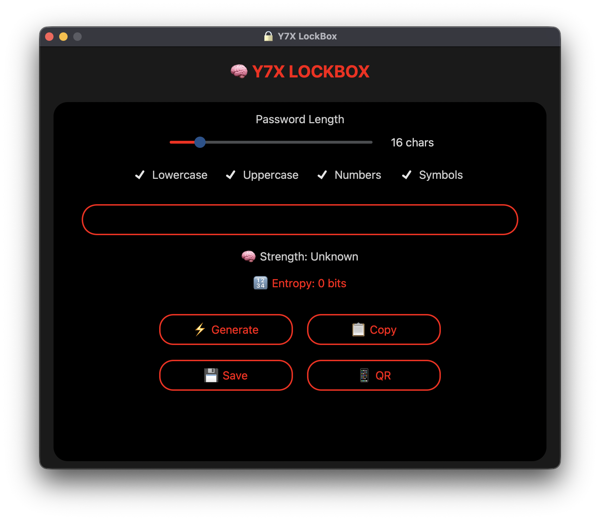

<div align="center">

# 🔐 LockBox
**💎 LockBox — Where Security Meets Style.**

💣 Military-grade password generator with red-outline AMOLED styling
Branded with 💗 by [Y7X-bit](https://github.com/Y7X-bit)



---

## 🌟 Features at a Glance


- 🔏 **Ultra-secure password generation** with charset selection
- 🧮 **Real-time entropy calculator**
- 📈 **Strength analysis** with GPT-style improvement tips
- 📋 **Clipboard support** with sound effects
- 📦 **Export password history** (📁 .txt file)
- 📱 **QR code output** for quick sharing
- 🌑 **True AMOLED UI** with red outlines + glowing effects
- 🎵 **Sound feedback** (click.wav)
- 🛡️ **Military aesthetics** for ultimate flex

---

## 🖥️ Installation

> Python 3.9 or later required

```bash
git clone https://github.com/Y7X-bit/LockBox.git
cd LockBox
pip install -r requirements.txt
python LockBox.py